## Membuat Program dan Modul 

### Menginput Data Mahasiswa Dengan Package dan Modul.

#### Berikut adalah penjelasan dari program data mahasiswa.

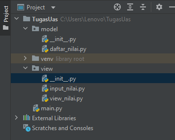                  
Gambar diatas adalah struktur modul dan package dari program data mahasiswa dengan beberapa ketentuan:
1. daftar_nilai.py berisi modul untuk tambah_data, ubah_data, hapus_data dan cari_data.
2. view_nilai.py berisi modul untuk cetak_daftar_nilai dan cetak_hasil_pencarian.
3. input_nilai.py berisi modul untuk menginput data mahasiswa.
4. main.py berisi program menu utama dimana pada main.py ini berfungsi untuk memanggil semua menu yang sudah tersedia.

#### Berikut adalah kode input untuk daftar_nilai.py
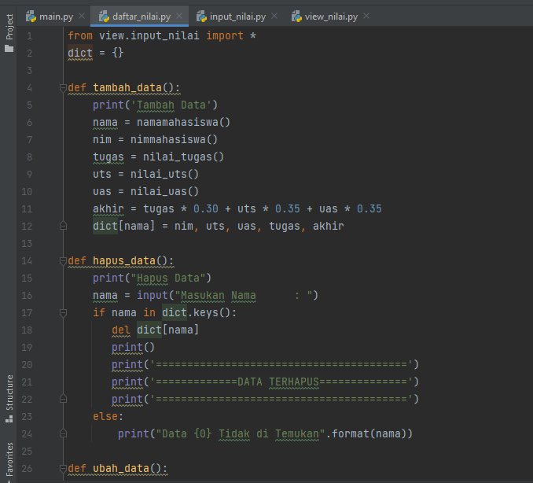
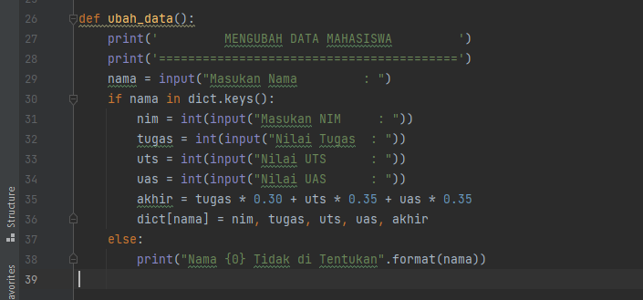

#### Berikut adalah kode inputan untuk input_nilai.py
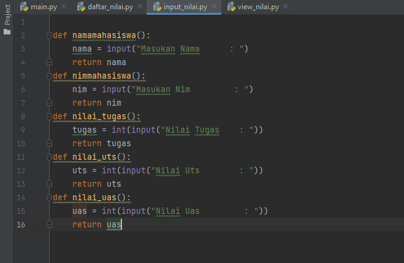

#### Berikut adalah kode inputan untuk view_nilai.py
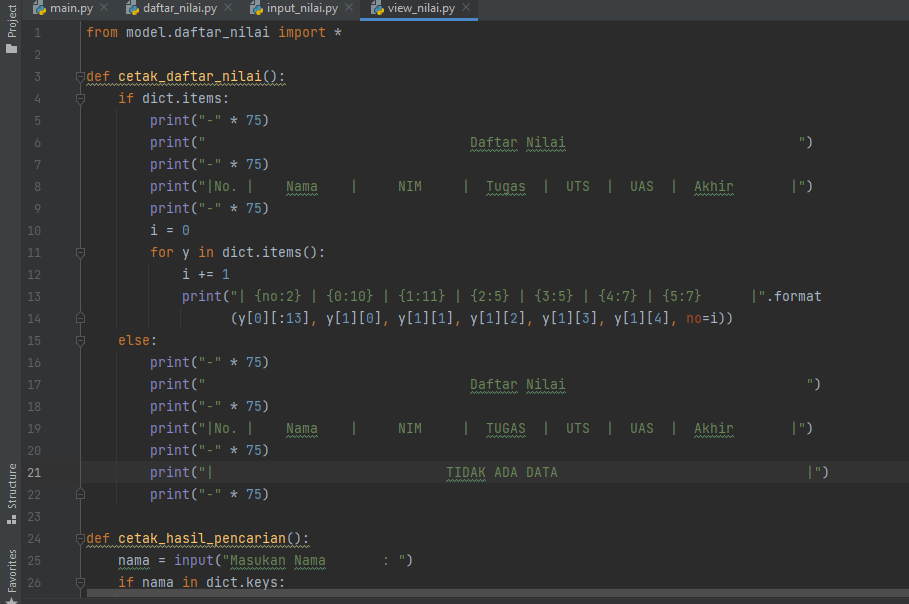
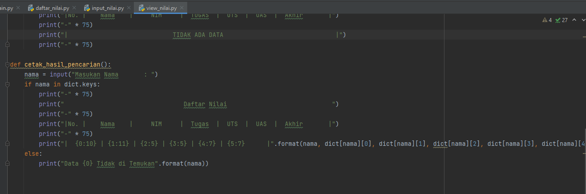

#### Berikut adalah kode inputan untuk main.py
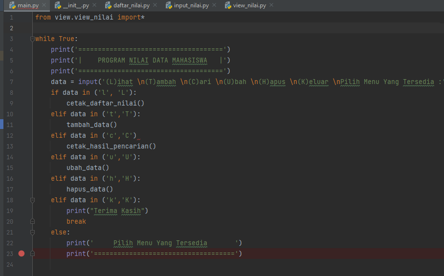

#### Output dari program data mahasiswa
1. output program sebelum memasukan data atau memilih menu yang sudah tersedia.     
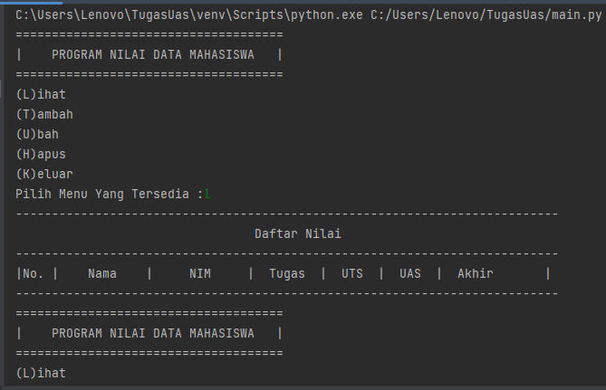
2. output program menambahkan data dengan memasukan nama, nim, nilai tugas, nilai uts, dan nilai uas.Menggunakan input yang sudah tersedia.     
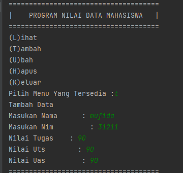
3. output program pencarian data dengan memasukan nama.     
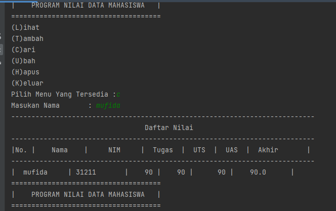
4. output program menambahkan data orang kedua dengan memasukan nama, nim, nilai tugas, nilai uts, dan nilai uas.       
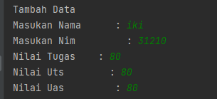
5. output program melihat data yang sudah diinput sebelumnya.       
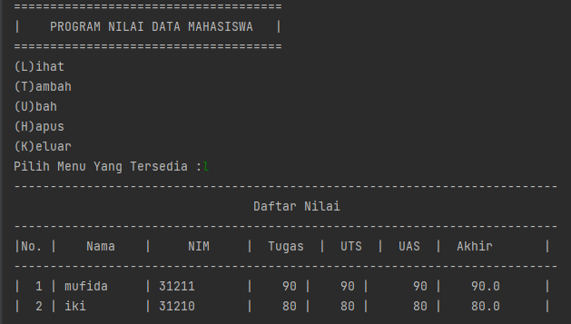
6. output program mengubah data dengan menginput nama mahasiswa yang sudah terinput sebelumnya dengan nim dan nilai yang sudah berubah.     
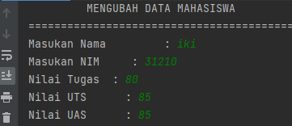
7. output program menghapus data dengan memasukan nama mahasiswa yang telah terinput sebelumnya, disini saya menghapus nama mahasiswa yang bernama iki.     
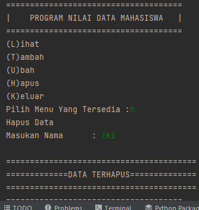
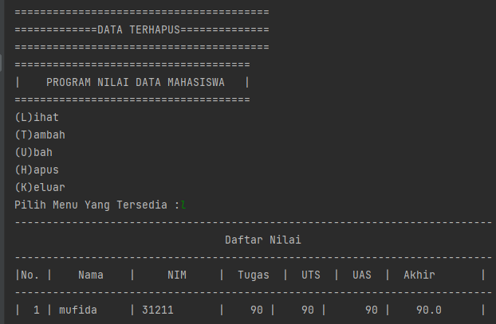
8. output program keluar untuk keluar dari program penginputan data mahasiswa.  
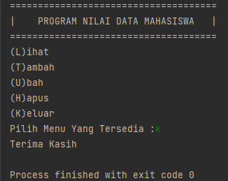